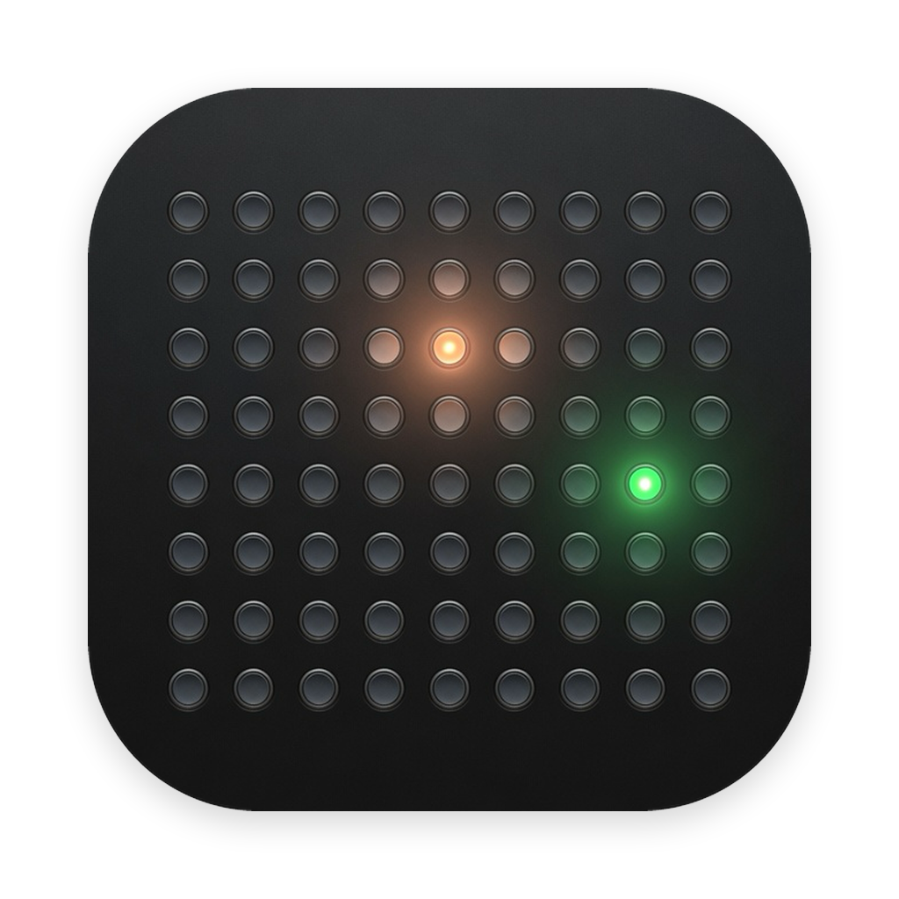
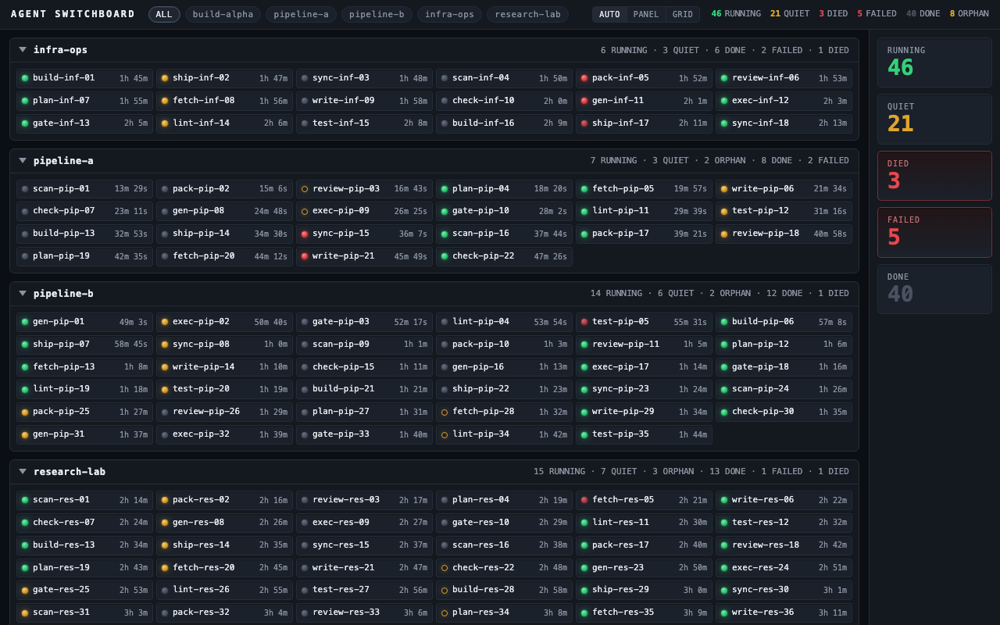
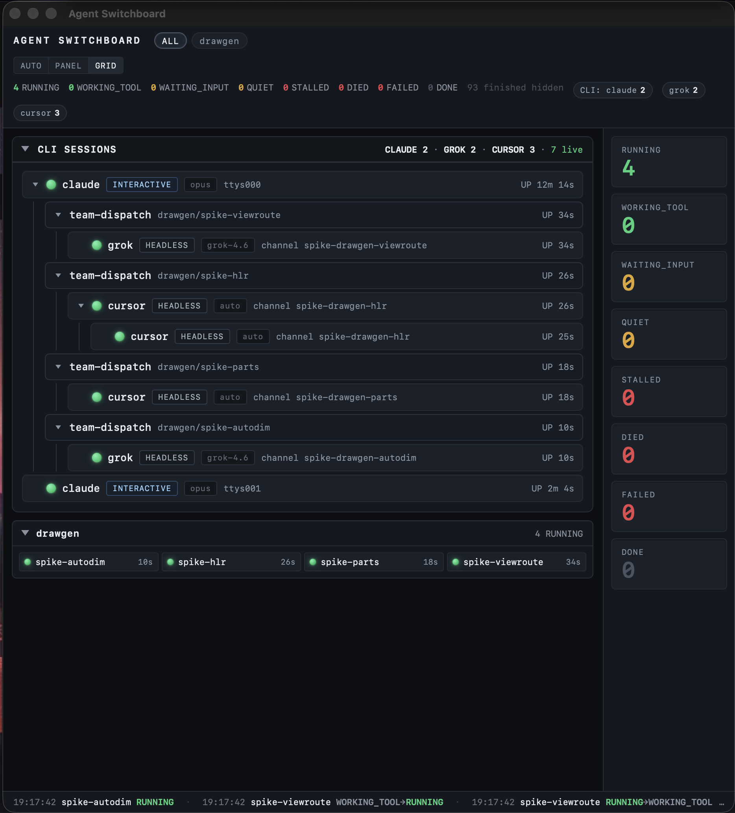

# Agent Switchboard



**A patch panel for your AI agent fleet.** Track every spawned agent as a
"lane" with a live derived state — no polling loops, no self-reported
heartbeats, no silent deaths — plus a native dashboard for watching 100+
agents across concurrent orchestrations.

Born from a common multi-agent failure mode: coordinators blocked in blind
`sleep` polling loops, and workers that die silently while logs still look
"running." Agent Switchboard replaces that pattern with derived liveness and
event-driven waits.





## How it works

Workers never have to cooperate or heartbeat. The wrapper records facts at
dispatch (pids, program identity, start time); the CLI/daemon derives state
from what the OS already knows:

| State | Meaning |
|---|---|
| `RUNNING` | worker alive, activity fresh (or unknown) |
| `WORKING_TOOL` | headless/tool-loop still making progress (open tool + log growth) |
| `WAITING_INPUT` | alive, last event is a permission/input prompt |
| `QUIET` | worker alive but silent past a threshold — warning, not failure |
| `STALLED` | headless silence past the stall budget — inspect, do not treat as dead |
| `ORPHAN` | worker alive but its wrapper died; exit will never be auto-recorded |
| `DONE` / `FAILED` | wrapper recorded exit 0 / non-zero |
| `DIED` | worker **and** wrapper gone without finalizing — the silent kill |
| `CORRUPT` | slot file unreadable — surfaced, never silently dropped |

**Observe/alert only, by design:** the switchboard never kills, restarts, or
re-dispatches anything. It tells your orchestrator; your orchestrator decides.

## The three verbs

```bash
# dispatch — wrap any worker; args, redirections, and exit code pass through
agent-dispatch --task mytask --lane worker-1 --exec <prog> -- <args...> > lane1.log 2>&1

# observe — derived state of every lane, instantly
switchboard status [--task mytask] [--json]

# wait — block until a lane finishes/dies/stalls/needs input, a refuse is
# logged, or a file changes (exit 0), or timeout (exit 3). --json prints the
# advise payload and always writes state/<task>/advise.json
switchboard wait --task mytask [--lane worker-1] [--watch-file PHASE.txt] --timeout 570 --json
switchboard advise --task mytask
```

`agent-dispatch` also enforces a per-task capacity cap (refusal = exit 2,
nothing starts, a `refuse` event is logged) and refuses to double-dispatch a
lane whose worker is still alive. Dispatch decisions are lock-serialized,
finalization is ownership-checked (`run_id`), and pid liveness is
identity-checked against the process table so a recycled pid can't fake a
live lane. Re-dispatch of an inactive lane archives the prior slot with a
`run_id` suffix and keeps the live path populated until the new slot is
written (no visibility gap). A backgrounded wrapper records `launcher_cli_pid`
while the parent CLI is still alive so the forest can reattach it.

## Background service + HTTP API

```bash
switchboard serve            # 127.0.0.1:17920, read-only
```

| Endpoint | Purpose |
|---|---|
| `GET /v1/health` | liveness, `version`, `boot_id`, `busy` / `busy_reasons` |
| `GET /v1/tasks` | known task names |
| `GET /v1/status[?task=T]` | derived lanes (includes `ended_s` for terminal rows) |
| `GET /v1/events?task=T` | recent observation log (tail-read; rotates under size cap) |
| `GET /v1/cli` | spawn-tree forest of live CLI sessions (claude / grok / agent_dispatch), including **virtual `grok-sub` rows** for a grok session's active in-process native subagents (pid-less, `virtual: true`, counted in `counts.grok_subagents`). Model is argv `-m` → session `current_model_id` → `[models].default` → `null` — never a hardcoded version. |
| `GET /v1/advise?task=T` | current advise payload (closed `next` verb list) |
| `GET /v1/wait?cursor=N[&task=T][&timeout=55]` | long-poll; returns within ~1s of a transition; `gap:true` if the cursor fell behind the ring |

CLI and status also support best-effort daemon wake-up via `--ensure` or
`AGENT_SWITCHBOARD_ENSURE=1` (launchd kickstart on macOS when the health probe
fails). Duplicate `serve` binds exit 0 after a healthy peer probe. SIGTERM
drains in-flight long-polls before exit. Idle self-exit (exit 0) arms only
after consecutive idle ticks and `IDLE_GRACE` when no CLI, viewer, or active
slot is present (fail-closed if process enumeration fails).

Autostart templates for launchd / systemd / Task Scheduler are in
[`service/`](service/). The launchd plist uses
`KeepAlive.SuccessfulExit = false` so intentional idle / duplicate-peer exits
stay down.

## Viewer app

A Tauri 2 desktop app (macOS + Windows) renders the daemon live: collapsible
per-task sections, panel rows or dense lamp grid (auto past 15 lanes),
attention-sorted DIED/FAILED, clickable state-filter tiles, event ticker,
**CLI SESSIONS** tree (model chips, apply-ordering guard), and a **START
DAEMON** button (launchd kickstart only — never kills lanes). Finished lanes
hide from the board after 30 minutes (`ended_s`); the CLI/JSON stay complete
(presentation-only retention).

Grab the signed DMG from [Releases](../../releases), or build it yourself:

```bash
cd viewer && npx @tauri-apps/cli@^2 build   # needs Rust + platform toolchain
```

Frontend is framework-free static HTML/CSS/JS; `viewer/dist/index.html?mock=1`
renders a 123-lane demo with no daemon at all.

## Integrating your harness

See [INTEGRATIONS.md](INTEGRATIONS.md) for the general pattern plus concrete
recipes: **Claude Code** (primary sessions vs subagents — they wait
differently, and getting this wrong silently abandons supervision),
**Grok Build**, **OpenAI Codex CLI**, **Cursor**, and anything else you can
launch from a shell.

## Configuration

| Env | Default | |
|---|---|---|
| `AGENT_SWITCHBOARD_ROOT` | `~/.agent-switchboard/state` | state location |
| `AGENT_SWITCHBOARD_WORKER` | *(unset)* | default `--exec` worker for `agent-dispatch` |
| `AGENT_SWITCHBOARD_MAX` | `10` | per-task capacity cap |
| `AGENT_SWITCHBOARD_CHANNEL_DIR` | *(unset)* | optional channel→sessionId map for QUIET |
| `AGENT_SWITCHBOARD_HOST` / `_PORT` | `127.0.0.1` / `17920` | daemon bind / ensure probe |
| `AGENT_SWITCHBOARD_EVENTS_MAX_BYTES` | `1000000` | events.jsonl rotate threshold |
| `AGENT_SWITCHBOARD_COLD_AFTER` | `86400` | cold-archive terminal slots (seconds) |
| `AGENT_SWITCHBOARD_BUS_MAXLEN` | `2000` | in-memory event-bus ring size |
| `AGENT_SWITCHBOARD_CLI_CACHE_TTL` | `5.0` | `/v1/cli` snapshot reuse (seconds) |
| `AGENT_SWITCHBOARD_IDLE_GRACE` | `300` | idle self-exit grace (seconds) |
| `AGENT_SWITCHBOARD_IDLE_DISABLE` | *(unset)* | `1` disables idle self-exit |
| `AGENT_SWITCHBOARD_IDLE_TEST_FORCE` | *(unset)* | test-only: treat CLI/viewer as not-busy |
| `AGENT_SWITCHBOARD_WAIT_CAP` | `24` | concurrent `/v1/wait` long-polls (503 beyond) |
| `AGENT_SWITCHBOARD_ENSURE` | *(unset)* | `1` = best-effort ensure_daemon on CLI |
| `AGENT_SWITCHBOARD_ENSURE_DISABLE` | *(unset)* | `1` = no-op ensure (tests) |
| `AGENT_SWITCHBOARD_ENSURE_NO_KICKSTART` | *(unset)* | `1` = probe only, no launchctl |
| `AGENT_SWITCHBOARD_STALL_AFTER` | `90` | headless silence budget (seconds) before `STALLED` |
| `AGENT_SWITCHBOARD_STALL_INTERACTIVE` | `900` | reserved interactive stall budget |
| `AGENT_SWITCHBOARD_GROK_SESSIONS` | `~/.grok/sessions` | grok session-dir root |
| `AGENT_SWITCHBOARD_GROK_CONFIG` | `~/.grok/config.toml` | grok `[models].default` source |
| `AGENT_SWITCHBOARD_CLAUDE_SETTINGS` | `~/.claude/settings.json` | claude default model |
| `AGENT_SWITCHBOARD_CLAUDE_PROJECTS` | `~/.claude/projects` | claude transcript root |
| `AGENT_SWITCHBOARD_BIN` | *(unset)* | switchboard binary for `exec-master-stop-hook.py` |
| `AGENT_SWITCHBOARD_EXEC_MASTER` | *(unset)* | `1` = treat hook caller as an exec-master |

Python 3.9+ stdlib only — no dependencies. macOS / Linux / Windows.
(Windows liveness uses `OpenProcess` via ctypes; `os.kill(pid, 0)` there
would *terminate* the probed process — don't roll your own with it.)

## Tests

```bash
bash tests/sb_test.sh    # 90 checks in an isolated temp state root
```

Covers happy paths and the dangerous ones: silent kills, the finalize-window
DIED false alarm, stale-wrapper clobbering, parallel capacity races, corrupt
slots, orphan lanes, path-escape names, first-sight publish, flocked events
rotation, re-dispatch visibility, boot_id/gap, cold-archive, idle self-exit,
SIGTERM drain, wait capacity 503, `/v1/cli` forest unit + live checks, model
truth (no hardcoded fallback), launcher reattach, stall/advise/refuse, and
the sample `SubagentStop` hook.

## License

MIT — see [LICENSE](LICENSE).
